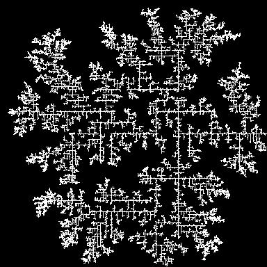
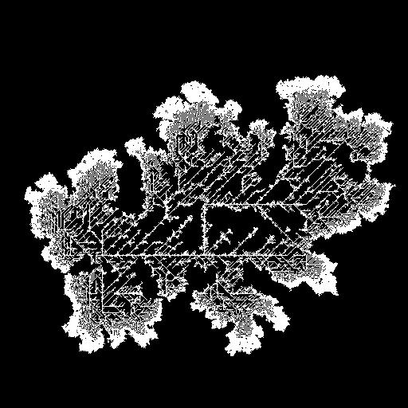
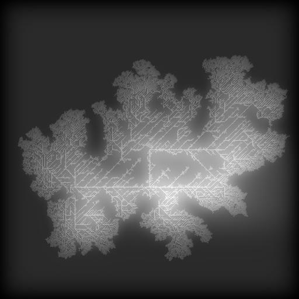

# Terrain Modelling

## Introduction

I have bene looking for new project ideas, mostly I have been looking at projects that require a little more performance from a languge. Although it seems almost every second person has implimented their own, I stumbled upon procedural terrain generation. While the simplest form is quite underwhelming, some of the additional features such as wind and water based erosion simulations sounded very exciting. So I decided I'd build a terrain simulation, aiming to eventually have the following features:

- procedural terrain generation
- water and wind based erosion simulations includign material properties

## First Implementation

I will be using Rust and [bevy](https://bevyengine.org/), a game engine built in rust, for this project. Initially I was considering using a library to use Vulkan or OpenGL directly in either C/C++, Rust or even trying something like Zig. I have a strong appreciation for languages like C and Zig which dont have as much complexity like C++ and in some aspects Rust. I've recently been doing more C and C++ at work for other projects and so I thought I would try rust after having used it for one of my personal projects.

At some stage I would like to make a super minimal engine as I would like to continue doing some of these kinds of projects but that is likely a number of projects in itself. For now the simplicity of getting something working in bevy is too appealing.

### Noise

To generate terrain I've looked at a handlful of different algorithms but Perlin noise seems to pop up everwhere. There are so many blog posts and tutorials for creating perlin noise it feels slightly dizzying trying to sift through the useful material. I found some material from [Matt Zucker](https://mzucker.github.io/html/perlin-noise-math-faq.html) very useful in addition to [this](https://www.cs.umd.edu/class/spring2018/cmsc425/Lects/lect13-2d-perlin.pdf) lecture on perlin noise. Combined with [Ken Perlin](https://mrl.cs.nyu.edu/~perlin/noise/)'s original code it was fairly simple to get something to compile. I had also seen a [blog](http://riven8192.blogspot.com/2010/08/calculate-perlinnoise-twice-as-fast.html) post several times discussing a faster implementation of the grad function. It seems to behave the same so far so I'll continue to run with that.

I had to do a little debugging, resolving the typical incorrect sign issues and so forth but in the end things looked okay. At the end of the day it was far easier to follow Ken Perlin's implementation directly, converting to Rust in this case of course, rather than interpreting some other blog. To visualise the data I used a PointList in bevy so get an initial view of the noise I was creating.


### Meshing

Some of the newer Bevy [custom meshing](https://bevyengine.org/examples/3D%20Rendering/generate-custom-mesh/) documentation was quite nice for getting a mesh going. After a few attempts where the entire screen was covered by triangles spanning from one side of the screen to another I had a terrain that looked somewhat reasonable.

Initially I used only verticle normals, trying to get the lighting (both ambient and directional) working with this setup led to some interesting looking shadow behaviour that made the terrain look very strange. To get rid of these stange shadows I actually calculated the normal vectors using an answer on [stack overflow](https://stackoverflow.com/questions/6656358/calculating-normals-in-a-triangle-mesh). The calculation simplifies to calculating the height differences between the adjacent row and column points and the output looked much nicer.


There are still some issues with the lighting which become apparent on both very smooth and very hilly terrain. The smooth surfaces become very shiny and the sharper terrain becomes dull. This is due to the vertical scale factor in the normal vector calculation mentioned before.

```rust
let normal = Vector3::new(height_diff_x, 2.0, height_diff_z).normalize();
```

Typically a value of 2 is suitable but in these extremes would need to be altered. Larger values are suited to flatter terrain keeping the normal vectors more vertical while smaller values are more suitable to more hilly terrain. This can be dynamically adjusted based on the height differentials but it isn't super necessary for this kind of simulation so I'll leave the value at 2 for now. It is also worth noting this seems more noticeable in the dimly lit scene I currently have, when increasing the light I found it much harder to notice.


With some tweaking of the noise generation, some ambient and directional light I was able to get a nice wavy terrain using the following config:

- size: 5000x5000, x and y point count
- scale: 5000.0, maximum amplitude
- octaves: 8, number of octaves of noise
- persistence: 0.5, decay constant of the octave noise

```rust
let size = 5000;
let octaves = 8;
let persistence = 0.5;

let width = size;
let height = size;
let scale = size as f32;
```

and light config:

```rust
fn setup_ambient_light(mut ambient_light: ResMut<AmbientLight>) {
    ambient_light.brightness = 200.0;
}

fn setup_lights(mut commands: Commands) {
    commands.spawn(PointLightBundle {
        point_light: PointLight {
            intensity: 30_000_000_000.0,
            range: 10_000.0,
            radius: 10_000.0,
            shadows_enabled: true,
            ..default()
        },
        transform: Transform::from_translation(Vec3::new(500.0, 1000.0, 500.0))
            .looking_at(Vec3::new(0.0, 0.0, 0.0), Vec3::Y),
        ..default()
    });
}
```

## Fixing Terrain Generation

I started to do some planning for the next stages of the development and what I actually want this project to turn into now that I have an extremely simple example running. The goal for me was to create an environment simulator. The main features being:

- terrain generation including material types such as sand, dirt and stone.
- terrain dynamics via water or wind erosion
- cloud generation and movement

To begin though I would like to start by improving some of the terrain generation. The octave perlin noise looks a little unrealistic and overly noisy. Some methods for improving this lie in hydraulic erosion, however there are some techniques to generate slightly more realistic terrain. As a start however, I needed to at least be able to alter the terrain while the application is running. I implimented an update function for the terrain, storing relevant world data on a component struct.

```rust
#[derive(Component, Debug)]
struct Terrain {
    size: usize,
    octaves: i32,
    persistence: f32,
    permutation: Vec<i32>,
    mesh_handle: Handle<Mesh>,
}
```

The initial perlin noise I was generating used a function to generate 3D perlin noise with the z value always set to 0. Changing the call to be implimented in the update function means I could scale the z value by the elapsed time in seconds to visualise changes in the mesh. I encountered a bug that, after some time, caused the terrain to vanish and strange flashes and lines to appear. Printing some values showed that the output of my perlin noise function exploded when one axis inputs to

```rust
pub fn octave_perlin3d(
    x: f32,
    y: f32,
    z: f32,
    octaves: i32,
    persistence: f32,
    permutation: &Vec<i32>,
) -> f32
```

the `octave_perlin3d` function increased above some threshold. The threshold itself, for my initial settings was 2.0. Diving deeper I discovered that this value changed as the octaves changed, due to the adjusted x, y and z values of the perlin3d function being above 255. It came down to using the \_x, \_y and \_z values as shown below.

```rust
fn perlin3d(x: f32, y: f32, z: f32, p: &Vec<i32>) -> f32 {
    let _x = x.floor() as usize & 255;
    let _y = y.floor() as usize & 255;
    let _z = z.floor() as usize & 255;

    // let xf: f32 = _x - x.floor() as f32; // incorrect
    // let yf: f32 = _y - y.floor() as f32; // incorrect
    // let zf: f32 = _z - z.floor() as f32; // incorrect

    let xf: f32 = x - x.floor() as f32;
    let yf: f32 = y - y.floor() as f32;
    let zf: f32 = z - z.floor() as f32;

    // ...
}
```

Fixing this meant that the perlin noise could be generated correctly. To assist with some performance I added some code to run the noise generation in paralell that I used in another project.

```rust
heightmap
    .map
    .par_iter_mut()
    .enumerate()
    .for_each(|(i, row)| {
        row.iter_mut().enumerate().for_each(|(j, elem)| {
            *elem = noise::octave_perlin3d(
                i as f32 / height as f32,
                j as f32 / width as f32,
                z,
                terrain.octaves,
                terrain.persistence,
                &terrain.permutation,
            ) as f32
                * scale;
        });
    });
```

The result looks a little weird, I find the slower terrain to almost be slightly intoxicating.


## Improving Terrain Generation

While Perlin noise can create some nice starting points, before I start with erosion and the full terrain model, I'd like to expand upon the heightmap generation. There are plenty of techniques for creating seemingly more realistic terrain. For example, erosion modelling is technically one of these but is more of a post-processing technique applied to a generated heightmap. For this I would like to focus on alternate algorithms of generating the heightmap itself. I spent a reasonable amount of time reading various papers on these techniques including:

- [Gradient Terrain Authoring](https://hal.science/hal-03577171/file/2022-gradientterrains.pdf)
- [The Synthesis and Rendering of Eroded Fractal Terrains](https://history.siggraph.org/learning/the-synthesis-and-rendering-of-eroded-fractal-terrains-by-musgrave-kolb-and-mace/)
- [Realtime Procedural Terrain Generation](http://web.mit.edu/cesium/Public/terrain.pdf)

amongst many others. I found [this](https://www.cs.cmu.edu/~112-n23/notes/student-tp-guides/Terrain.pdf) article to be an interesting overview of various techniques used and a good introduction I wish I had found earlier. Eventually I stumbled upon [Josh's Channel](https://www.youtube.com/watch?v=gsJHzBTPG0Y) discussing exactly the topic I was interested in. I found [Diffusion-limited Aggregation](<https://pmc.polytechnique.fr/pagesperso/dg/cours/biblio/PRB%2027,%205686%20(1983)%20Witten,%20Sander%20%5BDiffusion-limited%20aggregation%5D.pdf>) (DLA) to be an interesting and very appealing option for an improved algorithm, epecially after reading through the original publication.

See [Directed Diffusion-limited Aggregation](https://alea.impa.br/articles/v14/14-15.pdf) (DDLA) for an extension.

I decided to implement DLA but first I wanted to convert some of my code to allow for additional algorithms if I find a nice one later. The following enum and `generate` function will allow me to pass in parameter structs to determine the algorithm I'd like to use for terrain generation. It feels like a reasonable solution for now.

```rust
pub enum Algorithms {
    FractalPerlin(FractalPerlinParams),
    DiffusionLimitedAggregation(DiffusionLimitedAggregationParams),
}

pub fn generate(algorithm: Algorithms) -> HeightMap {
    match algorithm {
        Algorithms::FractalPerlin(fractal_perlin_params) => {
            generate_fractal_perlin(fractal_perlin_params)
        }
        Algorithms::DiffusionLimitedAggregation(diffusion_limited_aggregation_params) => {
            generate_diff_lim_agg(diffusion_limited_aggregation_params)
        }
    }
}
```

### DLA

#### Points

In simple terms, DLA places at least a one starting point on a grid, then spawns and moves a particle around the grid until it is next to an existing particle. It then stops and a new particle is spawned, and so on. Fundamentally it is quite a simple algorith that produces some pretty cool features! One thing I have noticed, at least in my implementation, is that there is a fine line between awesome terrain and garbage when tweaking parameters.

There are many possible additions to this base level of the algirthm to influence how the tree develops. Particle "stickyness" is a probability of a particle sticking when it encounters an existing one. Lower probabilities cause more dense trees. I'm using an absorbtion equation from [Josh](https://www.youtube.com/watch?v=gsJHzBTPG0Y).

```rust
fn absorbtion(t: f32, b: u32) -> f32 {
    return t.powi((3 - b) as i32);
}
```

Extra initial particles can be used to start clusters in multiple locations and even complex shapes can be used to author more distinct terrain.


I've found the clusters seem to avoid each other for some reason.

Particle spawn behaviour also plays a large part in the overal shape. I'm only picking a random point on the grid but limiting the particle spawns to particular regions is also a useful technique.

#### Heightmaps

The next stage of DLA is making a heightmap from these "point trees". The height The algorithm itself is as follows:

- Create a base point map
- Repeat the following for x layers
  - Scale the heightmap
  - Filter the heightmaps
  - Scale the pointmap
  - Add detail to the pointmap
  - Add detailed pointmap to heightmap
- Apply last filtering stages

Firstly, to determine what the height of each particle is, when a particle attaches to another particle we keep track of which particle attached to other particles. The height is the based on the height of the largest attached particle +1. To keep track of particles and their connections I used a hashmap to keep all the particles and I have a struct with a function to calculate the height based on the linked particles and the reference hashmap.

```rust
impl Particle {
    pub fn new(point: Point) -> Self {
        Self {
            linked: Vec::new(),
            point,
        }
    }

    pub fn link(&mut self, key: (u32, u32)) {
        self.linked.push(key);
    }

    pub fn height(&self, map: &HashMap<(u32, u32), Particle>) -> f32 {
        let mut m = 0.0;
        for a in self.linked.clone() {
            if let Some(t) = map.get(&a) {
                let h = t.height(map);
                if h > m {
                    m = h;
                }
            } else {
            }
        }

        return m + 1.0;
    }
}
```

This allows me to check the height at any point on the map. Two things to note, I don't have any circular referencing checks which will leads to stack overflows if it occurs, and I don't have height caching for performance. Circular referencing should only be a problem if I am incorrectly populating the hashmap and the performace isn't slow enough for me to notice compared to populating the tree so I'm going to leave things as is.

For the next steps of DLA, this hashmap of points also needs to be scalable. At this stage I'm limiting to a scaling factor of 2. I haven't thought of a nice way to do the scaling for non-integer scaling factors yet. I start with any point in the hashmap, place it and the linked particles on a new map and then repeat for all the linked particles. For a scaling factor of 2 I scale the points and then place one particle in the middel. One issue with this is that when scaling, especially by a large number of layers, the grid appears very square. It is possible to see with moveable positions either as straight linear directions or also including the diagonals.

```rust
*   3   *
0   x   2
*   1   *

0   7   6
1   x   5
2   3   4
```




A fix that helps remove some of these artefacts is "nudging" the connecting particle to a nearby pixel that still connects the two particles. I am yet to implement this though as I need to include more checks (circular referencing issue) to prevent the application crashing if the new particle exists. This is not the simplest because of how the tree traversal is computed when scaling the particle map. On the plus side, the height map, once filtered, looks reasonable without this addition.

Note: The height evaluation is still buggy and I plan to revisit it. Like many things in this project, it is only an issue when running diagonal connections I'm leaving it for now.

Scaling of the heightmap is similarly simple but slightly different. With a scaling factor of 2, any single point on the heightmap translates to 4 on the scaled heightmap. Filtering is a convolution operation between some filter kernel and the heightmap itself. So far I've only tested gaussian kernel convolutions but I'd like to test other things too. The resulting heightmap looks, as expected, like a blurry version of the particle trees.


Additional details is then added after the particle tree has been expanded.



As mentioned before, the kernel parameters and how they scale with the size of the map heavily impact how nice the resulting terrain looks. Some parameters producing some really weird outputs. It is possible to see discrete square chunks in the final heightmap output. I suspect these are mostly due to how the kernel parameters are scaled.

As a final filtering stage I apply some more fine blurs to the image to brush out any super sharp edges in various places along the map. This will remove a lot of the finer detail that rests on the map but thats fine.

#### Final Touches and Thoughts

While the algorithm is not totally complete, efficient or free of major bugs and the algorithm itself is a lot more complex than something like perlin noise, the final terrain outputs are really quite pretty.

In the same way fractal perlin noise is run over multiple octaves allowing for sharper detail to be added to the map with lower amplitude, I'd like to try convert the DLA algorithm into something similar. In fact just adding a perlin noise map works quite nicely at adding a little more variety in the overall DLA map.


## Terrain Model

After ironing out some issues, I feel quite happy with the terrain generation. Erosion, typically using partical simulated erosion techniques, is a fairly simple technique for generating nice looking terrain from a baseline such as the perlin noise I have been generating or even to give additional detail to terrain generated with improved algorithms.

Up until now I have been working with a heightmap generated from the noise functions or some other algorithm. This model is sufficient for a simple simulation that applies erosion to a homogeneous property terrain. For this project, I would like to model terrain that contains terrain of various properties. With this I can apply properties such as the erosion hardness for determining how susceptible the terrain is to erosion, or cohesion, how "sticky" the material is to itself and other things around it.

My initial thought went to [voxels](https://en.wikipedia.org/wiki/Voxel), or some variant such as [octrees](https://en.wikipedia.org/wiki/Octree), however, the disrete nature makes the terrain erosion also a discrete system. I want to maintain a reasonably high resolution on the meshed terrain though and so I played around the idea of fillable voxels, extended the octree where necessary to create additional detail. A fillable voxel would allow for the "height" to be calculated byu the filled volume of the voxel. I actually quite like this concept for something such as groundwater systems and fluid diffusion but that is for a later date. In the "fillable voxel" model, if a different material is deposited on another material, the actual height can be the sum of the filled voxels. At this stage I realised that really what I had thought of was a layer map where each block on the grid has an array of layers that makes up the terrain in that verticle section. Material can be added to or removed from layers with new layers only needed for a change of material type. For this system, if there are many material types, or similar to reality, the material is some distribution of all the possible parameters, the layers stack up very quickly as particles move around. However, this simulation will mostly play with several more discrete material types to mimic material such as stone, soil or sand. This means a lot of the material ends up condensing into large blocks of terrain layers.

I found a [blog](https://nickmcd.me/) with a couple of posts implementing basically the exact thing I wanted to implement and a [post](https://nickmcd.me/2022/04/15/soilmachine/) on a data model for this application seemed to progress towards the style of model I was thinking of too. Reading further into the content it seems like a lot of works are very similar to what I've been wanting to try out.

For an actual data model I have several criteria:

- The terrain and operations are easily computed in parallel
- Fast access for regularly used data such as terrain height, normals, etc
- Able to update terrain ouptuts for meshes efficiently (e.g. grid chunks)
- Simplicity

### Implementation

After having mulled over rough implementation ideas I started to actually write code. I started with a couple of structs I'd use for each of the elements. I added a `Chunk` struct, mostly to remind myself of the idea but I don't think I will actually end up using this for updates to the terrain mesh.

```rust
pub struct Terrain {
    width: usize,
    height: usize,
    cells: Vec<Vec<Cell>>,
}

pub struct Material {
    erosion: f32,
    cohesion: f32,
    saturation: f32,
    permeability: f32,
}

pub struct Layer {
    height: f32,
    material: Material,
}

pub struct Cell {
    layers: Vec<Layer>,
    layer_index: i32,
}

pub struct Chunk {}
```

### Erosion

## Performance
